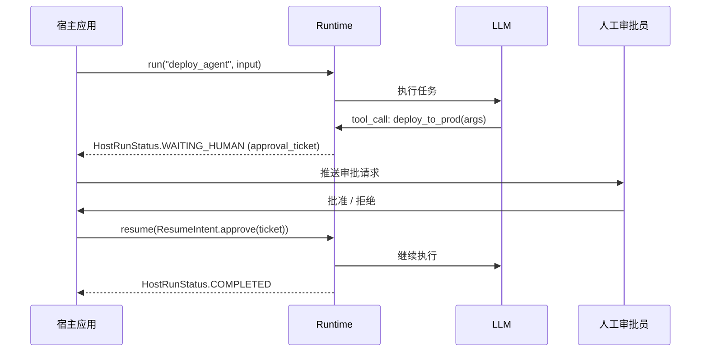
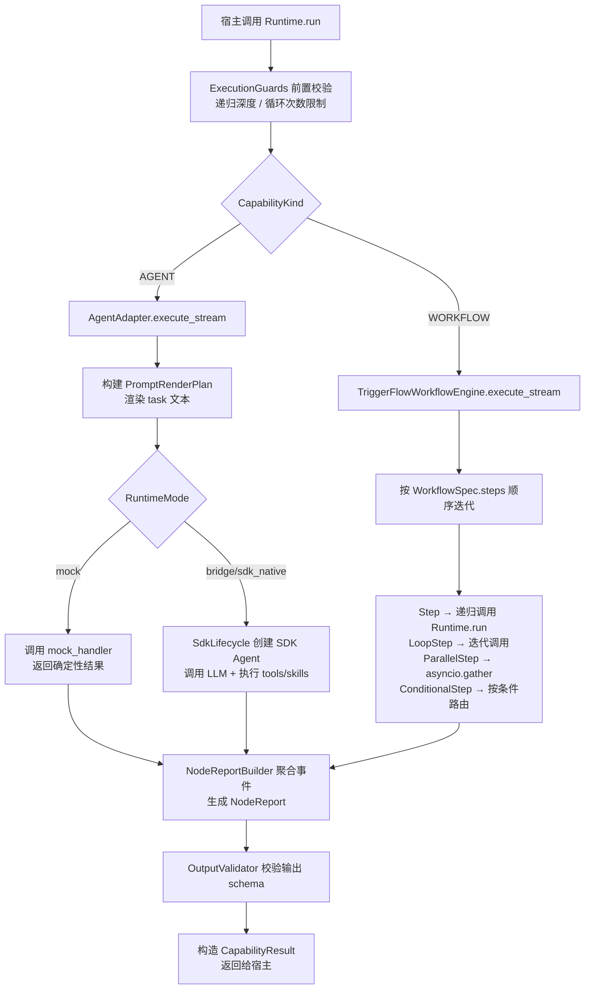

> 把一个能"跑通"的 AI Agent Demo，变成一个能"放心用"的生产系统——这中间差的，叫运行时。

## 一、项目背景：AI Agent 的工程缺口

2025年以来，LLM 的能力突飞猛进，Agent 应用随之爆发。但现实很快揭示了一个令人尴尬的事实：

**大多数 Agent Demo 都有一个共同的软肋——它们只是 Demo。**

LangChain、AutoGen、CrewAI 这些框架降低了构建 Agent 的门槛，但真正想把 Agent 部署到生产环境时，开发者往往要自己解决一长串问题：

- **可测试性**：怎么在不调用真实 LLM 的情况下测试业务逻辑？
- **执行证据**：Agent 调用了什么工具？返回了什么？出错了在哪一步？
- **人工审批**：敏感操作需要人确认，怎么让 AI 暂停等待？
- **工作流编排**：多步任务怎么组织顺序、并行、条件分支？
- **崩溃恢复**：长任务中途失败了，能从断点续跑吗？
- **宿主集成**：怎么把 Agent 嵌入已有的业务系统？

`capability-runtime`（GitHub: [okwinds/capability-runtime](https://github.com/okwinds/capability-runtime)）是一个面向上述问题的 **生产级 Python 运行时框架**。它定位精准：不重新发明 LLM 调用，不替代工作流引擎，而是作为一个**契约收敛层**，把两个已有的上游系统整合成一个稳定、可测试、可观测的宿主 API 面。

---

## 二、核心思路：胶水层而非框架

`capability-runtime` 的架构如下：

```
┌─────────────────────────────────────┐
│          宿主应用（你的业务代码）       │
│  register capabilities / run / stream │
└──────────────────┬──────────────────┘
                   │
                   ▼
┌──────────────────────────────────────────┐
│           capability-runtime              │
│                                           │
│  公共契约（对外稳定）                      │
│  ├─ AgentSpec / WorkflowSpec              │
│  ├─ Runtime.run() / run_stream()          │
│  └─ NodeReport / HostRunSnapshot          │
│                                           │
│  内部适配层（对外不可见）                  │
│  ├─ AgentAdapter                          │
│  ├─ TriggerFlowWorkflowEngine             │
│  └─ session continuity bridge             │
└──────────────────┬───────────────────────┘
                   │
         ┌─────────┴─────────┐
         ▼                   ▼
┌────────────────┐  ┌──────────────────┐
│ skills-runtime │  │  Agently /        │
│ -sdk           │  │  TriggerFlow      │
│                │  │                  │
│ skills + tools │  │ OpenAI-compatible │
│ approvals      │  │ transport         │
│ WAL / events   │  │ workflow engine   │
└────────────────┘  └──────────────────┘
```

**两个上游各司其职：**

| 上游 | 负责的事 |
|------|---------|
| `skills-runtime-sdk` | 技能注册与调用、工具执行、人工审批、WAL 日志、事件证据链 |
| `Agently / TriggerFlow` | OpenAI-compatible 传输层、工作流编排内部实现 |

`capability-runtime` 做的事是：**收窄**。把两套系统的复杂接口，收敛成一个更小、更稳定的宿主侧契约面。这种"胶水层"设计有个明显好处——上游任意一个系统升级或替换，宿主业务代码不需要动。

---

## 三、安装与快速上手

### 安装

```bash
# 从源码安装
pip install -e .

# 或（PyPI 发布后）
pip install capability-runtime
```

依赖清单简洁：
- `pydantic>=2`（数据建模）
- `agently==4.0.8`（LLM 传输层）
- `skills-runtime-sdk==0.1.12`（技能/工具/WAL）

### 三分钟跑通最小闭环

`mode="mock"` 不需要任何真实 API Key，纯本地可运行：

```python
import asyncio
from capability_runtime import AgentSpec, CapabilityKind, CapabilitySpec, Runtime, RuntimeConfig

def handler(spec, input, context=None):
    return {"echo": input}

async def main():
    # 1. 初始化运行时（mock 模式）
    rt = Runtime(RuntimeConfig(mode="mock", mock_handler=handler))

    # 2. 声明并注册一个 Agent
    rt.register(AgentSpec(
        base=CapabilitySpec(id="echo", kind=CapabilityKind.AGENT, name="Echo")
    ))

    # 3. 校验注册表（可捕获配置错误）
    assert rt.validate() == []

    # 4. 执行并查看结果
    result = await rt.run("echo", input={"x": 1})
    print(result.status)   # CapabilityStatus.SUCCESS
    print(result.output)   # {"echo": {"x": 1}}

asyncio.run(main())
```

---

## 四、核心概念详解

### 4.1 能力原语：Agent vs Workflow

框架的核心抽象只有两个：

**`AgentSpec`** —— 声明一个 AI 能力单元：

```python
from capability_runtime import AgentSpec, AgentIOSchema

agent = AgentSpec(
    base=CapabilitySpec(id="code_reviewer", kind=CapabilityKind.AGENT, name="代码审查员"),
    system_prompt="你是一个严格的代码审查员，关注安全性和可维护性。",
    tools=["run_linter", "check_types"],          # 可用工具名称列表
    skills=["code_search", "doc_query"],           # 可注入的技能
    input_schema=AgentIOSchema(
        fields={"code": "str", "language": "str"},
        required=["code"]
    ),
    output_schema=AgentIOSchema(
        fields={"issues": "list", "score": "int", "summary": "str"}
    ),
    loop_compatible=True,     # 是否支持被 LoopStep 循环调用
)
```

**`WorkflowSpec`** —— 声明一个多步骤编排流程，支持四种步骤类型：

```python
from capability_runtime import (
    WorkflowSpec, Step, LoopStep, ParallelStep, ConditionalStep, InputMapping
)

workflow = WorkflowSpec(
    base=CapabilitySpec(id="review_pipeline", kind=CapabilityKind.WORKFLOW, name="审查流水线"),
    steps=[
        # 顺序步骤
        Step(id="fetch", capability=CapabilityRef(id="code_fetcher")),

        # 循环步骤：对每个文件调用审查器
        LoopStep(
            id="review_each",
            capability=CapabilityRef(id="code_reviewer"),
            iterate_over="step.fetch.files",    # 数据源表达式
            item_input_mappings=[
                InputMapping(source="item.path", target_field="code")
            ],
            collect_as="review_results",
            fail_strategy="collect"             # 失败时收集而非中止
        ),

        # 并行步骤：同时执行多路分析
        ParallelStep(
            id="parallel_checks",
            branches=[
                Step(id="security", capability=CapabilityRef(id="security_checker")),
                Step(id="perf",     capability=CapabilityRef(id="perf_analyzer")),
            ],
            join_strategy="all_success"
        ),

        # 条件步骤：按风险等级分发
        ConditionalStep(
            id="route",
            condition_source="step.parallel_checks.security.risk_level",
            branches={
                "high":   Step(id="human_review", capability=CapabilityRef(id="human_gate")),
                "medium": Step(id="auto_fix",     capability=CapabilityRef(id="auto_fixer")),
            },
            default=Step(id="approve", capability=CapabilityRef(id="auto_approve"))
        ),
    ]
)
```

### 4.2 三种执行模式

通过 `RuntimeConfig.mode` 一键切换，代码逻辑不变：

| 模式 | 用途 | 是否需要 LLM |
|------|------|-------------|
| `mock` | 本地单元测试，handler 由你提供确定性结果 | ❌ |
| `bridge` | 生产环境，Agently 传输 + skills-runtime-sdk 执行语义 | ✅ |
| `sdk_native` | 直连 skills-runtime-sdk，绕过 Agently 传输层 | ✅ |

```python
# 开发/测试
config = RuntimeConfig(mode="mock", mock_handler=my_mock)

# 生产
config = RuntimeConfig(
    mode="bridge",
    workspace_root=Path("."),
    sdk_config_paths=[Path("config/skills.yaml")],
)
```

### 4.3 执行证据链：NodeReport

每次 `run()` 都返回完整的执行证据，不是一个黑盒：

```python
result = await rt.run("code_reviewer", input={"code": "..."})

report = result.node_report
# NodeReport 包含：
# - status: 执行状态（成功/失败/等待/取消）
# - tool_calls: 每次工具调用的参数和返回值
# - approval_summary: 审批历史
# - wal_locator: WAL 日志定位符（崩溃可从此恢复）
# - meta: prompt hash、渲染模式等元数据
```

配合 `HostRunSnapshot` 可以得到宿主侧运行摘要：

```python
snapshot = summarize_host_run_result(result)
print(snapshot.status)          # HostRunStatus.COMPLETED
print(snapshot.approval_ticket) # 如有待审批则非空
print(snapshot.events_path)     # WAL 事件路径
```

### 4.4 人工审批流（HITL）

内置 Human-in-the-Loop 支持，AI 执行到关键节点时自动挂起：



代码实现：

```python
# 第一轮：触发审批后挂起
result = await rt.run("deploy_agent", input={...})
snapshot = summarize_host_run_result(result)

if snapshot.status == HostRunStatus.WAITING_HUMAN:
    ticket = snapshot.approval_ticket
    # 把 ticket 推送给审批员...

    # 审批通过后续跑
    resume = build_resume_intent(
        run_id=ticket.run_id,
        approval_key=ticket.approval_key,
        decision="approve"
    )
    final_result = await rt.run("deploy_agent", input={...}, resume_intent=resume)
```

---

## 五、适用场景

### 5.1 企业 AI 平台（高审计要求）

金融、医疗、法律等行业对 AI 操作的可解释性和可审计性有严格要求。`capability-runtime` 的证据链设计（每次执行的完整 WAL 日志 + 工具调用记录 + 审批历史）天然适合这类场景。

### 5.2 自动化运维（CI/CD + 故障处理）

仓库中有一个 `ci_failure_triage_and_fix` 示例，完整模拟了：
- 解析 CI 失败日志
- 定位根因
- 生成修复建议
- 可选人工确认后执行修复

这类"读写操作混合"的 Agent 任务，HITL 机制是刚需。

### 5.3 复杂文档/表单处理（多步 Pipeline）

`form_interview_pro` 示例展示了多轮对话式表单填写——把复杂的结构化信息采集拆成多个 Agent Step，每步聚焦一个问题域，最终汇总输出。

### 5.4 需要 SSE 推流的前端应用

```python
async for event in rt.run_stream("my_agent", input=data):
    yield f"data: {event.json()}\n\n"
```

`sse_gateway_minimal` 示例提供了开箱可用的 HTTP/SSE 包装，直接对接前端实时展示 Agent 执行过程。

### 5.5 需要离线测试的 AI 工程团队

这一点往往被低估。`mode="mock"` 让你可以：
- 在 CI 流水线中跑 Agent 逻辑测试（0 API 费用）
- 测试所有工作流分支（包括罕见的错误路径）
- 用快照测试固化 Agent 行为，防止 Prompt 改动引入回归

---

## 六、技术实现原理

### 6.1 核心执行流程



### 6.2 AgentAdapter 的 Prompt 渲染机制

`AgentAdapter` 把 `AgentSpec` + `input` 翻译成 SDK Agent 的任务文本，支持三种渲染模式：

| 模式 | 适用场景 | 说明 |
|------|---------|------|
| `structured_task` | 默认，通用任务 | 自动组织 `## 系统指令 / ## 任务 / ## 输入 / ## 输出要求` 四段式结构 |
| `direct_task_text` | 纯文本任务，不需要结构化输入输出 | 直接把 prompt_template 渲染后发给 LLM |
| `precomposed_messages` | 完全自定义消息列表 | 绕过自动渲染，直接传入 messages 数组 |

### 6.3 WorkflowSpec 的数据流动

WorkflowSpec 中的步骤通过**数据源表达式**传递数据，不依赖全局状态：

```
step.{step_id}.{field}       # 引用某步骤的输出字段
context.{field}              # 引用工作流初始 context
item.{field}                 # LoopStep 内引用当前循环项
```

例如 `iterate_over="step.generate.items"` 表示：
"把 `generate` 步骤输出的 `items` 字段作为循环集合"。

这种**表达式驱动的数据流**设计，使得 WorkflowSpec 可以被纯静态分析，无需执行就能验证数据依赖关系。

### 6.4 WAL 与崩溃恢复

WAL（Write-Ahead Log）来自 `skills-runtime-sdk`，`capability-runtime` 通过 `NodeReport.wal_locator` 暴露其位置：

```
执行开始
  │
  ├─ WAL: 记录 run_id, capability_id, input_snapshot
  │
  ├─ WAL: 记录每次 tool_call 的 name/args
  ├─ WAL: 记录 tool 返回值
  │
  ├─ [如需审批] WAL: 记录 approval_ticket
  │  └─ 等待人工 → resume 后继续
  │
  └─ WAL: 记录最终 output + status
```

崩溃时可通过 `wal_locator` 定位日志，从最后一个成功的检查点续跑。

### 6.5 服务门面（ServiceFacade）模式

```python
from capability_runtime import RuntimeServiceFacade

facade = RuntimeServiceFacade(runtime)

# 发起请求（返回 handle，不等待完成）
handle = await facade.submit(RuntimeServiceRequest(
    capability_id="my_agent",
    input={"task": "..."},
    session_id="user-123"
))

# 轮询或 await 结果
result = await handle.wait()

# 流式消费
async for event in handle.stream():
    print(event)
```

`RuntimeServiceFacade` 把 Runtime 包装成一个 **request/handle 模型**，更接近微服务调用范式，适合构建 HTTP API 或消息队列对接层。

---

## 七、值得借鉴的工程经验

通读这个项目，有几处设计让我印象深刻：

### 7.1 收窄契约面（Narrow Contract）

项目 README 里有一句话值得反复读：

> "The public contract of this repository is intentionally narrow."

`__init__.py` 只导出了经过精心挑选的 30 余个名字——尽管内部实现有几千行代码。这种**"宽内部、窄出口"**的设计让升级和重构变得安全：内部大幅重构，只要出口不变，调用方代码就不需要改动。

对比 LangChain 的情况，内部类频繁泄露到公共 API，导致每次大版本升级都是一场噩梦。

### 7.2 模式切换而非多入口

不同的运行模式（`mock/bridge/sdk_native`）通过 `RuntimeConfig.mode` 这一个配置切换，而不是提供三个不同的 Runtime 子类或工厂方法。

```python
# 只有一个入口，模式决定行为
rt = Runtime(RuntimeConfig(mode="mock"))   # 测试环境
rt = Runtime(RuntimeConfig(mode="bridge")) # 生产环境
```

好处是：**测试代码和生产代码共享同一套执行路径**，mock 跑通了，bridge 也大概率没问题。

### 7.3 frozen dataclass 作为配置/协议对象

项目大量使用 `@dataclass(frozen=True)`：

```python
@dataclass(frozen=True)
class AgentSpec:
    base: CapabilitySpec
    tools: List[str] = field(default_factory=list)
    # ...
```

`frozen=True` 意味着这些对象创建后不可变，可以安全地在并发环境中共享，也可以做哈希（用于缓存）。同时 Pydantic v2 的 `BaseModel` 在数据验证场景中也有使用，两者各司其职。

### 7.4 严格区分"真相源"与"投影"

项目把 `NodeReport`（证据链真相源）和 `RuntimeEvent`（UI 投影事件）严格分开：

```
AgentEvent（底层 SDK 事件）
    │
    ├──→ NodeReportBuilder（聚合成 NodeReport，是真相源）
    │
    └──→ RuntimeUIEventsMixin（旁路投影，不影响 NodeReport）
```

即使 UI 事件系统出 bug，`NodeReport` 也不会被污染。这是一种典型的**"审计日志不能被投影层修改"**的设计原则。

### 7.5 docs_for_coding_agent 目录

仓库里有一个专门的 `docs_for_coding_agent/` 目录：

> "compact pack for coding agents"

这是给 AI 编码助手（比如 Cursor、GitHub Copilot）准备的精简文档包——比完整文档小，但包含了 AI 完成编码任务所需的全部上下文。

这个设计暗示了一种新的文档组织思路：**文档不只是给人看的，也要考虑 AI 的消费方式**。随着 AI 辅助编程的普及，这种"双轨文档"可能会成为开源项目的标准配置。

### 7.6 preflight 的"fail-closed"原则

```python
def preflight(self) -> List[FrameworkIssue]:
    try:
        # ...执行 preflight 检查
    except Exception as exc:
        # preflight 异常不得 fail-open
        # 否则 preflight_mode="error" gate 会被绕过
        return [FrameworkIssue(...)]
```

这个注释体现了一个重要的安全工程原则：**当守门逻辑本身出错时，应该默认拒绝（fail-closed），而不是默认放行（fail-open）**。在涉及外部操作的 AI Agent 中，这一原则格外重要。

---

## 八、总结

`capability-runtime` 代表了 AI Agent 工程化的一个成熟方向：

| 问题 | 解决方案 |
|------|---------|
| 如何测试 Agent 逻辑？ | `mode="mock"` 离线测试 |
| 如何知道 Agent 做了什么？ | `NodeReport` 完整证据链 |
| 敏感操作如何介入？ | 内置 HITL 审批流 |
| 复杂任务如何编排？ | `WorkflowSpec` 四种步骤类型 |
| 如何给前端推流？ | `run_stream()` + SSE |
| 长任务崩溃如何恢复？ | WAL + `wal_locator` |
| 如何与业务系统解耦？ | `RuntimeServiceFacade` |

它不是一个"万能框架"，也没有试图成为那样的东西。它的价值恰恰在于**克制**——只解决运行时层面的问题，把 LLM 能力、工具执行、业务逻辑都留给上游和宿主去定义。

如果你正在从 Demo 走向生产，或者在搭建一个需要审计和审批的 AI 系统，这个仓库值得认真研究。

---

*仓库地址：[github.com/okwinds/capability-runtime](https://github.com/okwinds/capability-runtime)*
